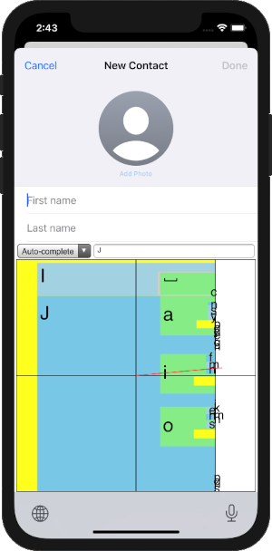

# Dasher Web in Captive Web View
This repository is for mobile and desktop apps that package Dasher Web in a
Captive Web View.

-   [Dasher Web](https://github.com/dasher-project/redash) is an Open Source
    re-implementation in web technologies of the original Dasher zooming text
    entry user interface.
-   [Captive Web View](https://github.com/vmware/captive-web-view) is a VMware
    Open Source project that facilitates use of web technologies in mobile and
    desktop applications.

# Dasher Custom Keyboards
The first project is the Dasher Web custom keyboards for Android and iOS.

-   Keyboard for Android.

    There is a Android Studio project for a functional custom keyboard for
    Android in the [Keyboard](Keyboard) sub-directory.

-   Keyboard and app for iOS.

    There is an Xcode project for a functional custom keyboard for iOS in the
    [Keyboard](Keyboard) sub-directory. The keyboard is packaged in an app.

For more screen capture images, see the
[ScreenCaptures](documents/ScreenCaptures) directory.

# Backlog
Check out our comprehensive [backlog](documents/Backlog.md), and send us a
request to help out!

# Contributing
We'd love your help! Check out our housekeeping
[rulebook](documents/Contributing.md) for best practices on contributing.

# License
Copyright (c) 2021 The ACE Centre-North, UK registered charity 1089313. MIT
licensed, see
[https://opensource.org/licenses/MIT](https://opensource.org/licenses/MIT).
